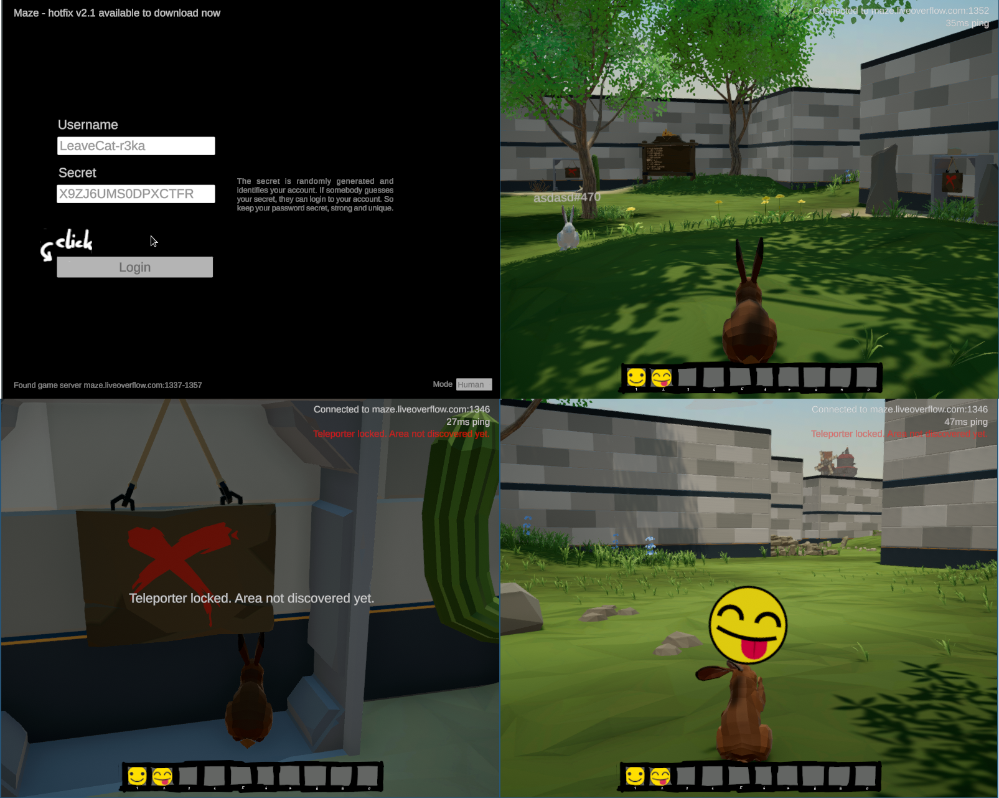

# Maze 1/6: Reversing the game (Emoji)

> Only real hackers can use secret emojis.

This is the writeup for the first challenge related related to the Maze game that was built for the CSCG 2020 qualification competition. Since I enjoyed these challenge, some of my solutions may involve a little more effort than what would be necessary if you just wanted to solve the challenge in the fastest way possible (as you would during a time-limited competition). I also cleaned up some of the scripts and solutions, so the actual solving process was not as straightforward as presented here, as I left out a lot of mistakes and things that didn't work out :)

## Exploring the game
To begin, let's take a short look at the game the challenge is based on. Here are some screenshots that showcase the basic functionality (from top to bottom, left to right: login screen, basic environment, locked teleporter, emoji):



Since maze is a networked multiplayer game, we first need to login with username/secret.
One thing to note here is that there seem to be multiple possible servers.
Before the text "Found game server: ..." is displayed, a few other messages appear in quick succession.
The login button also only becomes active once the "Found game server" text is display.
We will come back to this later.

After logging in, we get to see the main part of the game: a rabbit who's lost in a big maze made of walls.
We can move around with cursor keys or WASD just as you would expect.
Sometimes, we can also watch other players (see asdasd in the screenshot).

When we move to the sign with a red cross, find out that those are teleporters. 
However, as you can see in the third screenshot, all of them are locked.
There's one more action we can take: by pressing numeric keys, we can send an emoji.
This is shown in the forth screenshot.

Right now, only two emoji are available (pressing the other keys does nothing).
The challenge tells us to use some secret emoji.
So the next part will be to find out what happens when an emoji is send, so that we control that and send our own emoji.

## Reverse engineering: analyzing the binary
There are two possible approaches to analyze the game. 
The first is to look at it dynamically, using a debugger and analyzing the network traffic.
The second one is to reverse engineer the binary statically, using static analysis tools.

We can start by looking at the network traffic. 
However, the network traffic seems to be obfuscated, as each connection generates unique traffic (there's no recognizable pattern in the bytes itself).
So let's try to use some static analysis next.

The game is an unity game. Unity is based on C#, so most of the original logic was probably written in that language.
Decompiling C# is usually pretty easy (using tools like dnSpy).
In this case though, the game was compiled with il2cpp, an Unity3D tool to convert C# to native code.
So if we open the binary with a decompiler, the code looks pretty ugly and hard to read:

```c
__int64 __usercall sub_9D8AC0@<rax>(__int64 *a1@<rdi>, __int64 a2@<rsi>, unsigned int a3@<r14d>)
{
  __int64 v3; // rbp
  __int64 v4; // rax
  __int64 v5; // rbp
  __int64 v6; // rbx
  char v7; // al
  __int64 v8; // rax
  __int64 v9; // rbx
  __int64 v10; // rax
  __int64 v11; // rbx
  __int128 v13; // [rsp+0h] [rbp-38h]

  v3 = *(_QWORD *)(a2 + 24);
  if ( !(*(_BYTE *)(v3 + 302) & 1) )
    sub_2E0380(*(_QWORD *)(a2 + 24));
  v4 = *(_QWORD *)(v3 + 192);
  v5 = *(_QWORD *)(v4 + 48);
  if ( !(*(_BYTE *)(v5 + 302) & 1) )
    sub_2E0380(*(_QWORD *)(v4 + 48));
  if ( a1 )
  {
    v6 = *a1;
    LOBYTE(a3) = 1;
    if ( !(unsigned __int8)il2cpp_class_is_assignable_from_0(v5, *a1) )
    {
      if ( !(*(_BYTE *)(v6 + 303) & 8)
        || (!(*(_BYTE *)(v5 + 272) & 0x20) && (v7 = *(_BYTE *)(v5 + 42), v7 != 30) && v7 != 19
         || (v8 = *(_QWORD *)(v5 + 112)) == 0
         || !*(_QWORD *)(v8 + 40)
         || !sub_2E0EA0(a1))
        && qword_113C4B8 != v5 )
      {
        a3 = 0;
      }
    }
  }
  else
  {
    v13 = 0LL;
    v9 = *(_QWORD *)(a2 + 24);
    if ( !(*(_BYTE *)(v9 + 302) & 1) )
      sub_2E0380(v9);
    v10 = *(_QWORD *)(v9 + 192);
    v11 = *(_QWORD *)(v10 + 48);
    if ( !(*(_BYTE *)(v11 + 302) & 1) )
      sub_2E0380(*(_QWORD *)(v10 + 48));
    LOBYTE(a3) = il2cpp_value_box_0(v11, &v13) == 0;
  }
  return a3;
```

Most functions have no symbols and are simply named `sub_...`, which makes it hard to reverse.
But, since the code originally was C#, and that language supports reflection and other runtime introspection features, surely the information must still be stored somewere?
As it turns out, there is even already a tool for recovering the lost information: https://github.com/djkaty/Il2CppInspector 

But, that tool unfortunately does not work out of the box on our binary:
```
$ Il2CppInspector -i GameAssembly.so -m Maze_v2_Data/il2cpp_data/Metadata/global-metadata.dat
...
CodeRegistration struct found at 0x00000000010D4480 (file offset 0x00ED4480)
MetadataRegistration struct found at 0x00000000010D4B40 (file offset 0x00ED4B40)
Analyze IL2CPP data: 1.79 sec
Unhandled exception. System.Collections.Generic.KeyNotFoundException: The given key 'mscorlib.dll' was not present in the dictionary.
   at System.Collections.Generic.Dictionary`2.get_Item(TKey key)
   at Il2CppInspector.Reflection.Assembly..ctor(Il2CppModel model, Int32 imageIndex)
   at Il2CppInspector.Reflection.Il2CppModel..ctor(Il2CppInspector package)
   at Il2CppInspector.CLI.App.Run(Options options)
   at Il2CppInspector.CLI.App.<>c.<Main>b__2_0(Options options)
   at CommandLine.ParserResultExtensions.MapResult[TSource,TResult](ParserResult`1 result, Func`2 parsedFunc, Func`2 notParsedFunc)
   at Il2CppInspector.CLI.App.Main(String[] args)
```
It complains about a module named "mscorlib.dll" not being found in the metadata. 
With some debugging, we find out the place where Il2CppInspector loads the modules is in `Il2CppInspector.Common/IL2CPP/Il2CppBinary.cs:185`:

```
// Array of pointers to Il2CppCodeGenModule
var codeGenModulePointers = image.ReadMappedArray<ulong>(CodeRegistration.pcodeGenModules, (int) CodeRegistration.codeGenModulesCount);
var modules = image.ReadMappedObjectPointerArray<Il2CppCodeGenModule>(CodeRegistration.pcodeGenModules, (int) CodeRegistration.codeGenModulesCount);
```

Some further debugging using `Console.WriteLine` shows that no modules are recognized by Il2CppInspector.
This is odd: if we look at the strings of "global-metadata.dat", "mscorelib.dll" definitely appears here.

Let's open up radare2 and check what's going on:

```
$ r2 -n GameAssembly.so # -n loads the file in raw, without mapping segments
 -- This is an unregistered copy.
[0x00000000]> s 0x00ED4480 # this is the address of the codegen reg struct printed in the log above
[0x00ed4480]> pxQ 16*8 # let's print 16 longs
0x00ed4480 0x0000000000000001 # reversePInvokeWrapperCount
0x00ed4488 0x00000000010d4a58 # reversePInvokeWrappers
0x00ed4490 0x0000000000002f4c # genericMethodPointersCount
0x00ed4498 0x00000000010b12b0 # genericMethodPointers
0x00ed44a0 0x0000000000000ea1 # invokerPointersCount
0x00ed44a8 0x00000000010833c0 # invokerPointers
0x00ed44b0 0x000000000000091e # customAttributeCount
0x00ed44b8 0x00000000010ac9c0 # customAttributeGenerators
0x00ed44c0 0x0000000000000211 # unresolvedVirtualCallCount
0x00ed44c8 0x00000000010cfe30 # unresolvedVirtualCallPointers
0x00ed44d0 0x000000000000010c # interopDataCount
0x00ed44d8 0x000000000110d9d0 # interopData
0x00ed44e0 0x0000000000000000 # codeGenModulesCount WEIRD: codeGenModulesCount == 0?
0x00ed44e8 0x0000000000000000 # pcodeGenModules
0x00ed44f0 0x000000000000002e #
0x00ed44f8 0x0000000001119c10 #
```
We can annotate the memory dump with the metadata fields (offsets can be found in Il2CppInspector.Common/IL2CPP/Il2CppBinaryClasses.cs).
As we can see, codeGenModulesCount in fact appears to be zero.
But, immediately following those two zeros is something that looks like it would fit much better: 0x2e seems like a valid count, 0x0000000001119c10 is a good offset.

So let's try that: we modify Il2CppBinaryClasses.cs like this, adding two unknown fields:
```csharp
...
public ulong interopData;

// --- BEGIN MODIFICATION
[Version(Min = 24.2)]
public ulong unknownCount;
[Version(Min = 24.2)]
public ulong unknownWhatever;
// ---- END MODIFICATION

// Added in metadata v24.2 to replace methodPointers and methodPointersCount
[Version(Min = 24.2)]
public ulong codeGenModulesCount;
[Version(Min = 24.2)]
public ulong pcodeGenModules;
```
After this simple modification, Il2CppInspector successfully recovers all the type definitions from the binary.
It also generates an IDA Python script, that we can import in IDA (using File -> Script File) to rename all functions and strings.
We can add a little bit of extra code so that it exports structures for IDA as well. The full patch that accomplishes that is attached.

Now, many functions have names, and searching the function list for "emoji" turns up two interesting results (along with some others we're not going to examine):
```
offset name
3C5020 ServerManager_sendEmoji
3C8060 ServerManager_showEmoji
```

## Getting the flag
We know that sendEmoji is the function to send an emoji to the server.
The second argument of the function seems to be a numeric code for the emoji that should be sent.
We can use this GDB script to easily send different emojis:

```gdb
# turn off some signal handling, the game generates a lot of signals
handle all nostop
set pagination off

# set $gamebase to the base address
python
gdb.set_convenience_variable("gamebase", int([x for x in gdb.execute("info proc mappings", False, True).split("\n") if "Game" in x][0].split()[0],16))
end

# whenever we hit the sendEmoji function ($gamebase+0x3C5020) and emoji is 22 (the second emoji), then
# we instead send the emoji $emoji and increment it by one
set $emoji=0
break *$gamebase+0x3C5020 if $rsi=22
commands
silent
set $rsi=$emoji
set $emoji=$emoji+1
continue
end
```

We can now cycle through all available emoji by pressing the second emoji a number of times.
When we reach the emoji with number 13, we get the flag: "CSCG{Your_hack_got_reported_to_authorities!}"

## Mitigation
How do you prevent someone from using "secret" emoji? Well, one solution would be not to have secret emoji at all. Or to have some kind of restriction on the users who are allowed to use them.

But, if we consider that feature is intended, then it's hard to avoid anyone from using it.
You can of course try to make it harder to reverse engineer the protocol (there's a lot of ways to do so, for example bogus control flow like implemented by obfuscator-llvm).
While that makes it more expensive for anyone to figure out the protocol, it cannot prevent it fully. 
If someone is able to run the game, they can also analyze it and figure out what it does. 
It is only a matter of the available resources they are willing to invest in the analysis.

