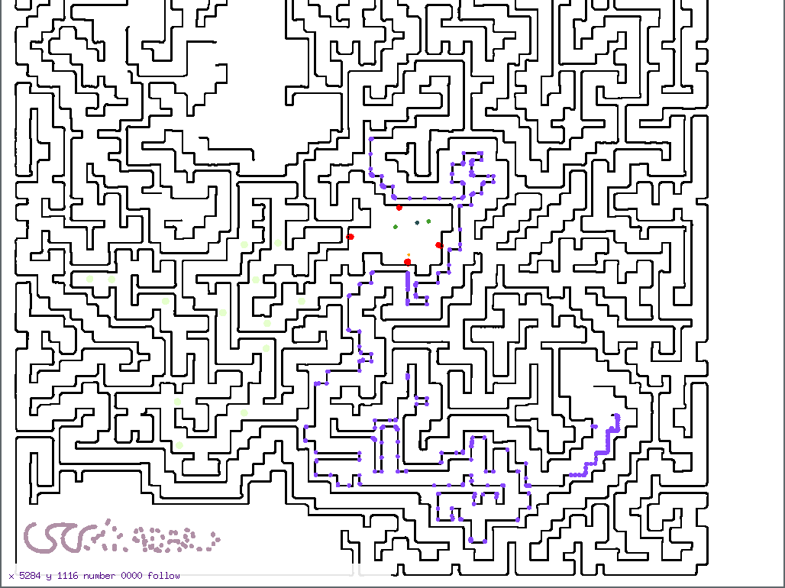
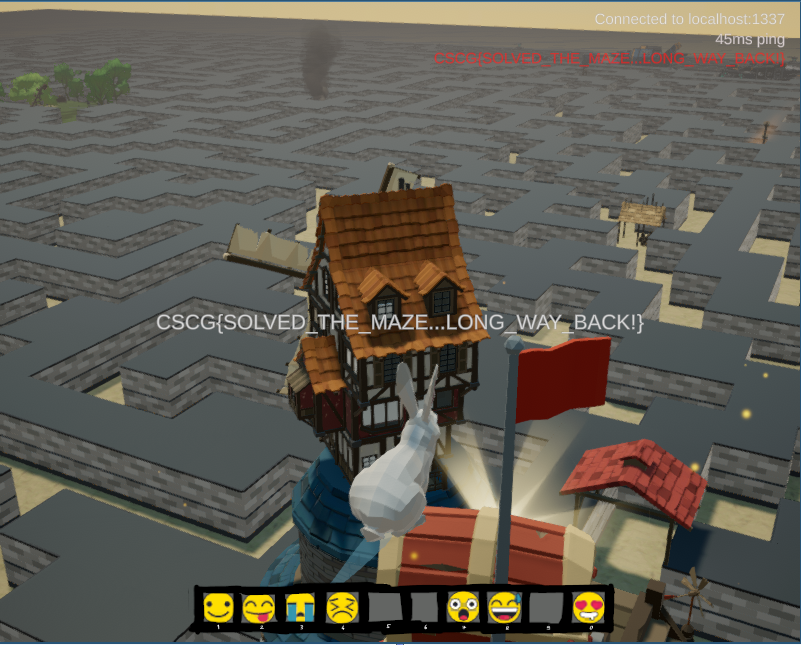

# Maze 2/6: More reversing and recovering the map (Tower)

> Find a path to reach the tower and climb to the top.

This is the writeup for the second challenge related related to the Maze game that was built for the CSCG 2020 qualification competition.
In the first challenge (emoji), we have already started to analyze the game binary.
We will continue that here and do some more reversing to build a crawler that recovers the map used by the server.
This allows us to find a path to the tower and get the flag.

## Building a client
If we want to automatically crawl the map without walking around manually,
we need to be able to connect to the server and move around automatically.
For this, we need to reverse the protocol to understand at least the login and movement network messages.

In challenge 1, we have already discovered the `ServerManager` class.
Looking at the other methods of that class, we find one called `ServerManager_RecieveDataThread` at offset `0x3C53F0`.
This function is interesting because it has a call to `UdpClient_Receive`, so it is probably processing the network packets.

A closer look reveals some loop doing XORing. This could explain why we all the packets looked scrambled
(the variables are renamed for readability) :
```c
v21 = buf->size;
data_size_ptr = (unsigned __int64)&decoded_bytes->size;
v17 = (unsigned __int8)buf->data[1];
LOBYTE(key) = buf->data[0];
readIdx = 0x200000000LL;
outIdx = 0LL;
do
{
    if ( outIdx + 2 >= (unsigned __int64)v21 )
    {
        v220 = 0LL;
        v169 = sub_2BC6E0(*(_QWORD *)&qword_113C4B0, "System", "IndexOutOfRangeException", &v220);
        sub_322D10(v169, 0LL);
    }
    packet_len = *(unsigned int *)data_size_ptr;
    if ( outIdx >= packet_len )
    {
        v221 = 0LL;
        v170 = sub_2BC6E0(*(_QWORD *)&qword_113C4B0, "System", "IndexOutOfRangeException", &v221);
        sub_322D10(v170, 0LL);
    }
    decoded_bytes->data[outIdx++] = buf->data[readIdx >> 32] ^ key;
    v21 = buf->size;
    end = (signed __int64)(((unsigned __int64)LODWORD(buf->size) << 32) - 0x200000000LL) >> 32;
    readIdx += 0x100000000LL;
    key = v17 + (unsigned __int8)key + ((unsigned int)v17 + (unsigned __int8)key) / 0xFF;
}
while ( outIdx < end );
```

So the first two bytes of the message are actually used for a simply XOR encryption scheme: the first byte is the initial xor key, and the second byte defines the increment.
We can reproduce this decryption in some simple Go code (and also implement the inverse for sending):

```go
func DecodeCipher(out, data []byte) []byte {
    curkey := data[0]
    key := data[1]

    for idx := 0; idx+2 < len(data); idx += 1 {
        out[idx] = data[idx+2] ^ curkey
        curkey = curkey + key + byte((uint16(key)+uint16(curkey))/0xff)
    }

    return out[:len(data)-2]
}
```

After this decoding routine, we can see a switch statement:
```
switch ( v16->byte20[0] ) {
...
}
```
This seems to switch on the packet type. Analyzing the cases (and looking at the referenced strings), 
we can deduce the following message types:

0x20 op_text_
0x3c 0x33 heartbeat <usersecret> <time>
0x43 got flag
0x44 death
0x45 sendemoji
0x46 fake_death ? (disable pos update)
0x49 info packet / info request
0x4c connect success / request login
0x50 position update
0x52 got race
0x54 teleport player
0x55 teleporter unlocked
0x58 exit?
0x59 logged in

With some more analysis, we can also recover the structure of the messages.
We can then implement all the messages in Go, see attached `protocol.go`.

For the login process, we find the function `ServerManager__LoginLoop_d__91_MoveNext` at offset `0x3E61B0`.
It eventually calls `sendData`, with the argument having the following structure:

```go
type LoginRequest struct {
	Secret  [8]byte
	NameLen uint8
	Name    [32]byte
}
```
`Secret` is computed as the sha256 of the password (first 8 bytes).

For finding out how movement works, we can look at `ServerManager_UpdateServerPosition` (see attached ida/updatePosition.c). Although the function looks a little bit ugly, it is not too hard to figure out the message layout. We send our own secret, and then the state of our player.

This is all we need for a working client. There is also a heartbeat message, which is sent by `ServerManager_sendHeartbeat`, which just contains our login secret plus a timestamp.
With a little bit of code, we can implement a simple client that just connects to the server
and prints the result of the login (see `login/main.go`).

## Building a proxy
For implementing our own client, one thing that's useful to have is a way to inspect and manipulate the messages
of the original game client.
To make this easy, we can build a proxy that can the process the messages.
This proxy will also turn out to be useful for some other tasks later.

To build the proxy, we note that the game connects to `http://maze.liveoverflow.com/api/` to retrieve the IP and port of the server to connect to (and some other information). By adding `127.0.0.1 maze.liveoverflow.com` to our `/etc/hosts` and running a simple fake API script (see `config/config.py`) on localhost port 80, we can an arbitrary IP/port pair to make the game connect there.

For our proxy, we just return `127.0.0.1` as IP and some port, and have a simple passthrough proxy listen there that receives packets and sends them to the original game server (and the same in reverse).
This is implemented in `proxy/proxy.go`.
We are now able to inject additional packets, or modify any of the sent/received packets.

Using our knowledge from the previous section, we can also decode the packets to test our understanding of the protocol. This is useful during the reverse engineering in addition to the decompiler output to figure out the exact packet structure and fields of each packet.

## Maze following algorithm
Now that we have a working client, we need an algorithm to recover the maze.
The first thing that we can try is simply moving straight in a single direction by some fixed step.
We can observe that this generates a lot of teleport messages after some time.
So that's how the server deals with walls: when we move somewhere blocked by a wall, it will teleport us back to a safe position.

We want to figure out what resolution the server uses for the map.
Movements can be made in very small steps (an example starting position: "2764491 2361110"),
and exploring 2 million points is not practicable.
We do this by extending the straight line mover: when we get a teleport, we reduce the step size, so eventually, 
we will move by a step of 1 until we are directly in front of a wall.
Here's the output of that script (`straighmover/main.go`):

```
2020/05/29 17:35:51 [TELEPORT] dest 3054938 20000 2527668 instant 1
2020/05/29 17:35:51 [TELEPORT] dest 3054938 20000 2527668 instant 1
2020/05/29 17:35:51 [TELEPORT] dest 3054970 20000 2527668 instant 1
2020/05/29 17:35:52 [TELEPORT] dest 3054986 20000 2527668 instant 1
2020/05/29 17:35:52 [TELEPORT] dest 3054994 20000 2527668 instant 1
2020/05/29 17:35:52 [TELEPORT] dest 3054998 20000 2527668 instant 1
2020/05/29 17:35:52 [TELEPORT] dest 3054998 20000 2527668 instant 1
2020/05/29 17:35:52 [TELEPORT] dest 3054999 20000 2527668 instant 1
```

The last teleport has `3054999` as target coordinate.
This suggests that the server stores the map in 1000x1000 tiles.
We will build the maze follower based on this assumption, which means we only check for walls in 1000x1000 tiles.

The algorithm to recover the maze is based on the popular right- or left-hand maze following algorithm:

- go forward until we find a wall
- when at the wall, repeat the following (in this state, there should always be a wall to the left of us)
    1. go one step parallel to the wall. If it fails, we found a corner. So we turn and follow the wall after the corner (repeat step 1).
    2. then, try to turn left (or right) and move one step
    3. if that step was successful, we found a corner. So we turn and follow the wall after the corner (goto step 1.)
    4. otherwise, we still have a wall to the left of us, so go to step 1
    
A step was successful if we don't receive a teleport within a given timeframe.
If we run the algorithm too fast, the teleports may arrive only after we've already done a few more steps.
To combat this problem a little, we can implement some mechanisms to clear the data between our current position and the teleport target and then start again at the teleport target position.

You can find the full implementation of the maze follower in `movement.go:runFollow`.
The map is stored in an append only log file, so that the follower can safely be restarted.
There's also an optimization to move faster if we already know the wall we're currently on.
It evolved quite a bit during the progress of solving the other challenges.

Letting the follower run over night will recover much of the map.
We also see that some new teleporters have been unlocked, one of them taking us close to the location of the tower.
At this point, we could use our custom client to go to the position of the tower.
But it's hard to know where to go exactly, since we don't have the position of the tower.
Therefore, we will use the original game client to get the flag.

You can see the follower bot in action in this screenshot. The purple points are the follower bot,
and you can see where it skipped over known walls (points in corners) and where it is currently exploring
(the dense set of points at the end).




## Getting the flag
Using our proxy, we can connect to the original game server.
We hijack the emoji messages to perform an additional function: adjusting our own height.
When the proxy sees an emoji, it remembers that as current emoji.
When it receives state request from the client, and the emoji is set to 0x17 or 0x16, 
it sends a teleport message to the client that increases or decreases the current height coordinate. 
This way, we can adjust our height in-game with the 1 and 2 keys.

The experience is really glitchy though.
This is caused by gravity, which interacts with our height adjustments in weird ways.
We can fix that by stubbing out the gravity function: `NormalMovement_ProcessGravity` at offset `0x3AC200`.
In GDB, we can run: `set *(int*)($gamebase+0x003ac200)=0xc3c3c3c3`, replacing the entry point of the function with four ret (0xc3) instructions.

Now, we can simply use the unlocked teleport to get close to the tower, adjust our height to get to the top (about 50000), and then walk to the flag. The server will then send the flag and we can enjoy a nice view of the game world: 


This picture also shows a much easier way to get the flag: instead of tracing the maze with a bot, we could have simply adjusted our height, made a few screenshots and then found the way to the tower manually.
However, I liked the challenge of recovering the map from the server directly, without relying on the assumption that the client-side view of the map accurately represents what the server uses for the logic.

## Mitigation
The "exploit" here is that we built a bot. That's hard to mitigate. 
One thing that could be made more resistant is the client side handling of teleports.
Allowing teleports to any height is probably not necessary, there could be some check that restricts the valid teleports so you cannot simply teleport yourself 1km into the sky.
But that check of course can be patched out as well.
