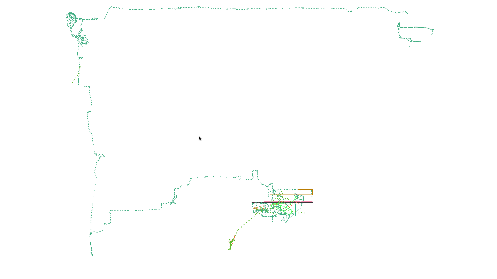
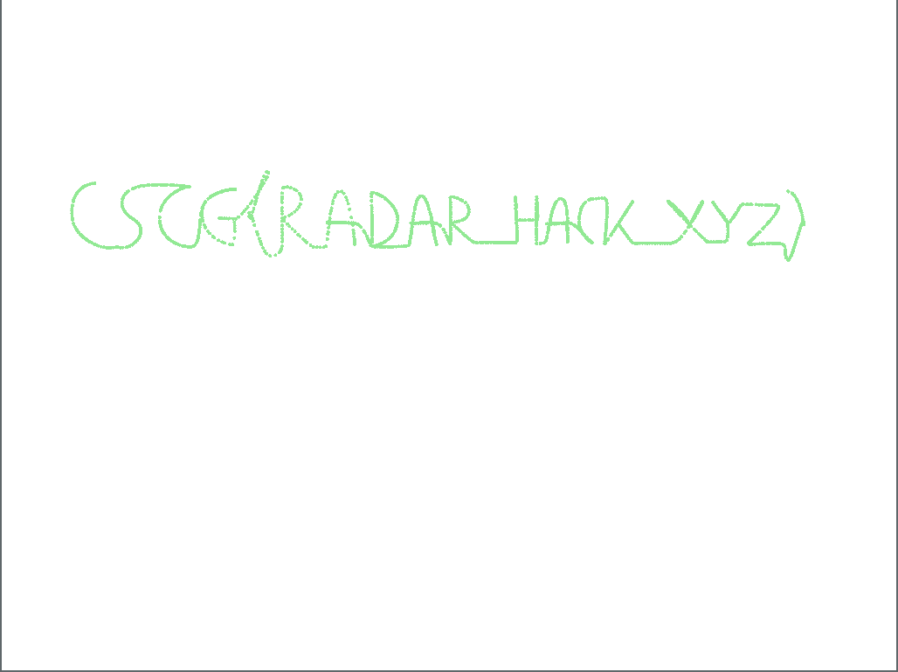
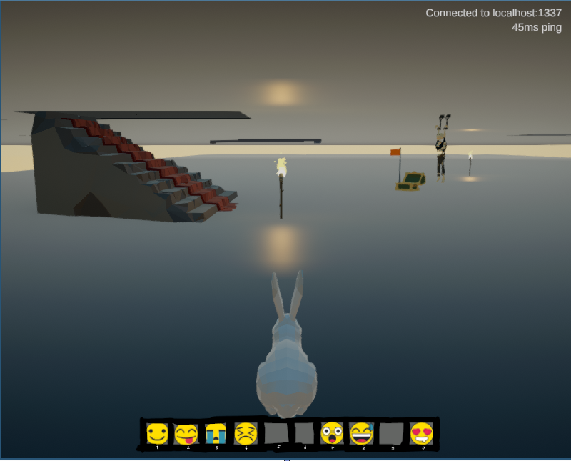

# Maze 3/6: Building a visualizer (Map Radar)

> There are rumours of a player who found a secret place and walks in a weird pattern. A radar map could be useful.

Already while developing the maze crawler for the second challenge, I figured it would be useful to see what my crawler was doing to debug it. So in this part, we are going to develop a simple visualizer of the game map and the players on it and solve the third challenge with it.

## The visualizer
From challenges 1 and 2, we already have code in Go to speak the server protocol. 
All that was left to build is a simple visual interface that keeps track of players positions
and renders them to the screen. 
We can use a very nice and simple 2D graphics library for go for that: https://github.com/faiface/pixel

The main part of the visualizer is really simple: whenever we get a state packet, we find all player's position and draw a circle at their location:
```go
// if we get a new packet
case packet := <-packets:
	var m maze.StateResponse
	matched, err := m.Parse(packet)
	if err != nil {
		log.Fatal(err)
	}

    // and this is state packet
	if matched {
		sum := [4]byte{}
        // render the players to the screen, deriving the color from the UID
		for _, p := range m.Players {
			hasher := fnv.New32()
			binary.Write(hasher, binary.LittleEndian, p.Uid)
			hasher.Sum(sum[:0])
			imd.Color = color.RGBA { sum[0], sum[1], sum[2], 0xff }
			imd.Push(pixel.V(float64(p.State.Pos[0])/1000, float64(p.State.Pos[2])/1000))
			imd.Circle(5, 0)
		}
    }
```
Simply running this in a loop results in a nice visualization of player movements:



## Getting the flag
The challenge now talks about some secret player. 
To find out who that player is, let's build a simple tool called `idlelog` that connects to the server and prints information about the players on that server.
Whenever it receives a state packet, we print the information about all players described by that packet.
The code is very simple with our existing protocol framework:

```go
client.AddHandler(func(payload []byte) bool {
    var state StateResponse
    if matched, err := state.Parse(payload); matched {
        if err != nil {
            log.Printf("state parse error: %v", err)
            return false
        }

        for _, player := range state.Players {
            log.Printf("[UID 0x%x] @%d %v", player.Uid, player.State.Time, player.State.Pos)
        }
    }
    return false
})
```

We also need a main loop that sends heartbeats and some noop state updates to stay connected which is not shown here (see the full code for details). With this, we can find a quite suspicious player:

```
2020/05/29 15:40:25 [HEARTBEAT] client 00000000 server 159075962543
2020/05/29 15:40:25 [UID 0xffff1337] @3795239 [2137918 -35000 297431]
```

First, the UID is 0xffff1337. Second, the height (second coordinate) is really low. 
If we look with our radar around that position, we can see that the player draws the flag:



And if you're curious how the secret place looks like, we can teleport there with the in-game client by using the proxy from the previous challenge and injecting a teleport packet (see `teleport/teleport.go`). We also need to suppress the server teleport packets for this, as it will continuously try to teleport us back. This is implemented in the proxy if the third emoji is active. Here's what we get:



## Mitigation
"Global Vision" cheats are quite common for games. The issue here is that the server sends the position of all players on the map to the client, not just the ones that the client can actually see from its current position.
To solve the issue, the server needs to compute what players are visible from the current client position and only send those player's position to the client. For complex games with not so simple vision rules, this can get quite hard.
