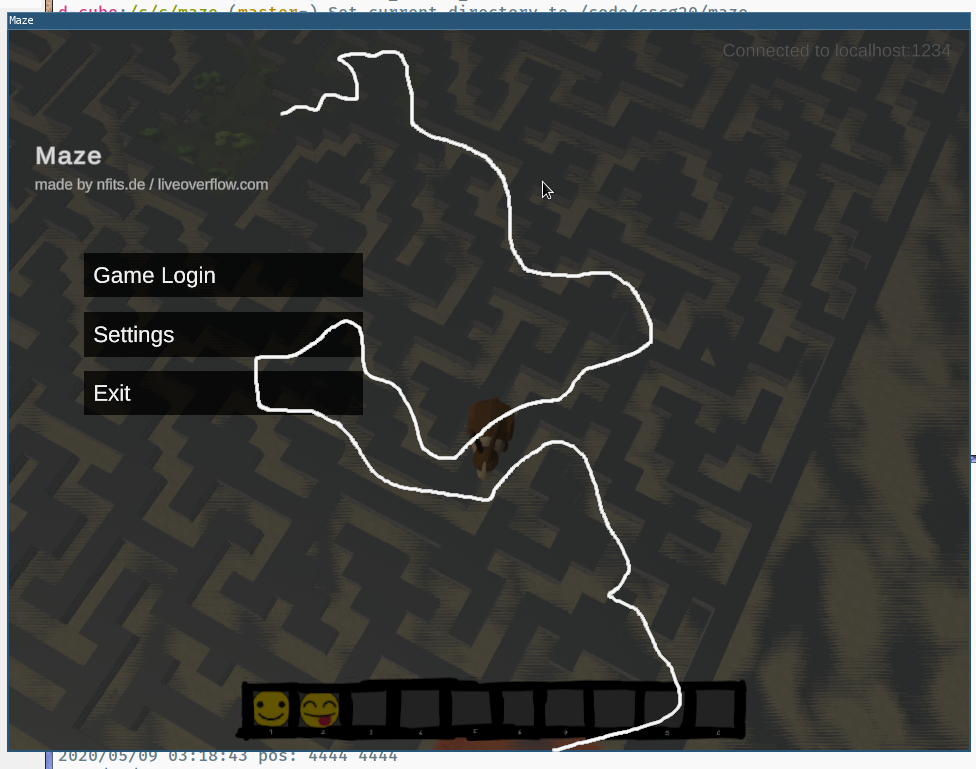

# Maze 4/6: Walking around (The Floor is Lava)

> Reach the chest surrounded by dangerous lava. 

For solving the fourth challenge, I extended the the visualizer I built for the third challenge (Map Radar)
to also allow interactive movements. With that, we can simply walk to the lava location to obtain the flag.

## Finding a path to the lava area
Although we already built a map crawler, it had not yet discovered enough of the map to make 
a path to the lava location viable.
But we can use another way: we start the in-game client and set our position to some big height, so we get good overview of the map (for how to adjust height, see challenge #2 Tower).
Then, we can find a path manually:



To walk that path, we can extend the visualizer to support interactive commands for movement.
Since the left mouse button is already used for dragging the map/view around, we use the left mouse button to implement moving.
This is implemented in `client/main.go`. 
Note that you need to specify `-user=someuser -pass=somepass` when launching to enable movement (if those options are unspecified, the client defaults to a passive mode without any active, controllable player).
The client automatically extends the map whenever we hit a wall.
To make this even more useful, it also supports a follow mode which can be activated by pressing W/A/S/D (it looks for a wall starting in the given direction and then follows that, completing the map).

## Getting the flag
Once we have a path to the correct area, we also need to find the exact coordinates of the flag position,
so we can walk there with our custom client.
With the game client, we can teleport to the approximate location using our proxy.
We can the walk to the correct location, and obtain the player position from GDB, using the following script:

```
set $update=$gamebase+0x3C80B0

# print a float vector
define printVector
  set $addr=(float*)$arg0
  printf "%f %f %f\n", $addr[0], $addr[1], $addr[2]
end

# step forward until the next ServerManager_Update call
# $sm is set to the ServerManager instance
define nextUpdate
  tbreak *$update
  commands
    set $sm = (long******************)$rdi
  end
  continue
end
```

Attach with GDB, and run:

```
nextUpdate
printVector ((long)$sm+0x1DC) # 0x1DC is the offset of the currentPosition field
```

This reveals the the position of the flag is around 4444/4444.
Getting the flag is now simple: fire up our custom client, walk to 4444/4444, and the server responds with: CSCG{FLYHAX_TOO_CLOSE_TO_THE_SUN!}

## Mitigation
Not sure what the "bug" here is, but assuming that the lava should have killed us somehow if we were at the ground, then issue is that we can "fly". This happens because the server does not do any physics simulation:
it simply trusts the client's height value. The fix for this is of course to perform physics on the server, and not trust the client.
