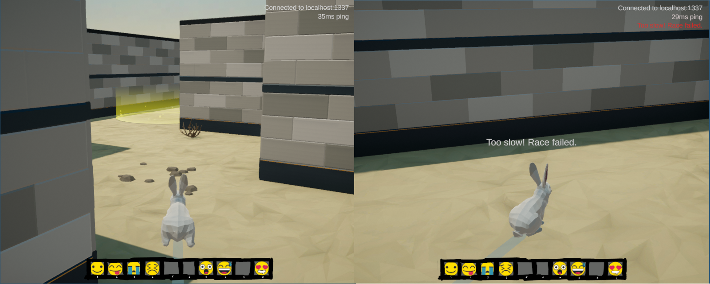
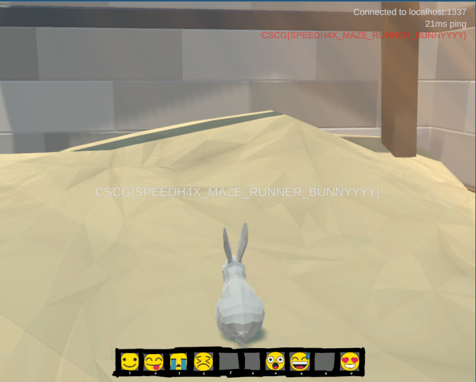

# Maze 5/6: Going fast (Maze Runner)

> Can you complete the scorch trials? 

The scorch trials appear to be a simple race. Taking the teleporter with the yellow glow at the start, we get to a location where we can see a yellow halo. Entering the first halo, a second one appears. However, before we can even reach that one, we get a message telling us that we are too slow:



How can we go faster? In this challenge, we will explore a way to go faster by modifying the client.
In the next challenge (Maze Runn3r), we will write a custom bot to automatically complete the raze.

## Getting the flag
We already discovered in a previous challenge that there is a `NormalMovement_ProcessGravity`.
If we check the other methods in the `NormalMovement` class, we find an interesting one: `NormalMovement_ProcessPlanarMovement` at offset `0x3AB270 `.
This method is interesting because of the following line:

```
 *(_OWORD *)v112 = *(unsigned int *)v7->speedMultiplier;
```

A speed multiplier! This seems to be exactly what we need! With a simple GDB script, we can break at that location and change the value of `v7->speedMultiplier`:

```
define setSpeedFactor
  set $speedFactor=$arg0
  tbreak *$gamebase+0x3AB2E0
  commands
    silent
    set *(float*)($rax+0x24)=$speedFactor # $rax+0x24 points to v7->speedMultiplier
    continue
  end
end
```

Fire up GDB, and run:

```
$ gdb -p $(pgrep -n Maze)
(gdb) setSpeedFactor 5
(gdb) continue
```

The game is now much more enjoyable to play. It now becomes possible to finish the race by hand
(you might need a few tries, if you take a wrong turn):



