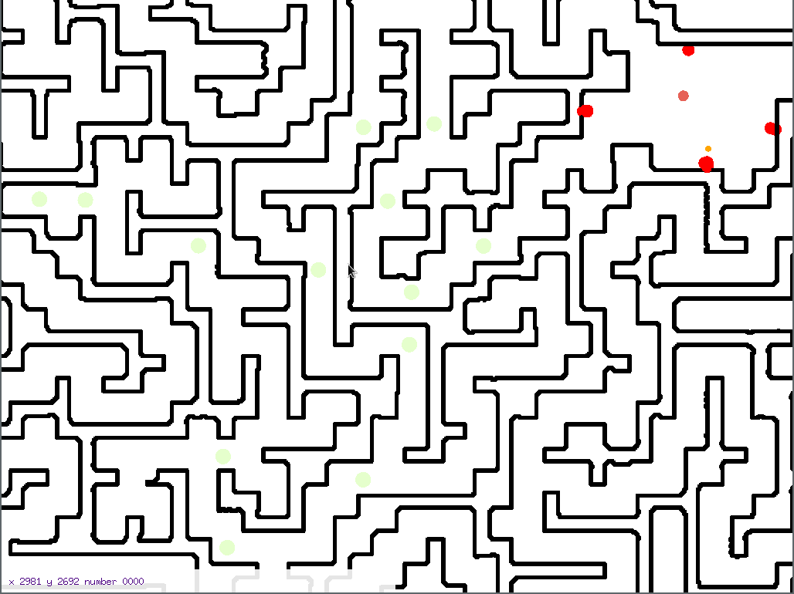
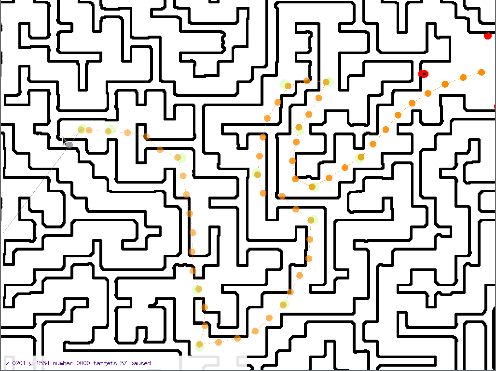

# Maze 6/6: Going faster (M4z3 Runn3r)

> Complete the scorch trials in under 5 seconds! 

This is just like the previous challenge (Maze Runner), but now we need to go *really* fast: 5 seconds for the entire track, which is faster than you can navigate by hand. Luckily, at this point, we already have enough infrastructure to build our own client, so we can automate the movements.

To complete the race, we need two things: we need to know the locations of the checkpoints (so we can plan our movements) and a client that sends our scripted movements to the server.

## Finding the checkpoint positions
Extracting the checkpoint positions is critical to plan our route, so let's start with that.
We can do that with GDB. First, recall that `Il2CppInspector` also generates a handy `types.cs` file.
Here's an excerpt of the parts we're going to use:

```csharp
public class ServerManager : MonoBehaviour // TypeDefIndex: 2986
{
    // Fields
    ...
    private RaceManager racemanager; // 0x70 = 8 * 14
    ...
}

...
public class RaceManager : MonoBehaviour // TypeDefIndex: 2982
{
    // Fields
    [SerializeField] // 0x00255070-0x00255080
    private GameObject[] checkpoints; // 0x18 = 8 * 3
    ...
```

If we look at the decompiled code for `ServerManager_Update` again, we can also see how to obtain the position of GameObjects:

```c
v13 = (__int64 (__fastcall *)(const char *))qword_1138AF0;
if ( !qword_1138AF0 ) {
    v14 = il2cpp_resolve_icall_0((void *)"UnityEngine.GameObject::get_transform()");
    v13 = (__int64 (__fastcall *)(const char *))v14;
    if ( !v14 )
    goto LABEL_564;
    qword_1138AF0 = v14;
}
// ... some parts elided ... 
if ( !qword_11373E0 ) {
    v16 = (void (__fastcall *)(__int64, int *))il2cpp_resolve_icall_0((void *)"UnityEngine.Transform::get_position_Injected(UnityEngine.Vector3&)");
    if ( !v16 )
    goto LABEL_567;
    qword_11373E0 = (__int64)v16;
}
```

This code dynamically resolves the locations of the `get_transform` and `get_position_Injected` unity functions.
So we know that at `0x1138AF0` is a function pointer to the `get_transform` function, and at `0x11373E0` a function pointer to the `get_position_Injected` function.

We are now ready to define some GDB functions that extract positions of a list of objects
(add these to the `.gdbinit`):

```
set $getTransform=(*(long (**)(long))($gamebase+0x1138AF0))
set $getPositionFunc=(*(long (**)(long, long))($gamebase+0x11373E0))


define getPosition
  # set up some stack to use for the call (needs to be correctly aligned, that's why we use &~0x3F)
  set $rspSaved=$rsp
  set $rsp=((long)$rsp-0x100)&~0x3F
  set $result = (float*)($rsp+0x10)
  call (void)$getPositionFunc($getTransform($arg0), $result)
  printf "%f %f %f\n", $result[0], $result[1], $result[2]
  # restore the stack pointer
  set $rsp=$rspSaved
end

define getPositions
  set $list=(long*)$arg0
  # the 4th long (idx 3) of a list stores the size
  set $size=$list[3]
  set $idx=0
  while ($idx < $size)
    # the data begins at the 5th (idx 4) long
    set $entry = $list[4 + $idx]
    getPosition $entry
    set $idx = $idx + 1
  end
end
```

Start the game, and then break at the next `ServerManager_Update` call
(see writeup #4 Lava for the nextUpdate GDB function):

```
(gdb) nextUpdate
(gdb) getPositions $sm[14][3] # $sm is a long****+ pointer, so we use indices in long (8 byte) offsets
203.880005 0.045998 193.929993
180.660004 0.045998 179.009995
173.029999 0.045998 208.419998
187.960007 0.045998 233.300003
165.229996 0.045998 232.210007
150.660004 0.045998 186.220001
180.000000 0.045998 162.199997
165.199997 0.045998 118.500000
121.300003 0.045998 96.600006
119.997658 0.045998 126.010071
112.000000 0.045998 194.000000
75.599991 0.045998 208.699997
60.479996 0.045998 208.960007
```
Voila, there are the positions of the checkpoints. It looks like the we need to multiply them by 10 to get actual world positions (they are way too small otherwise).
We can add some rendering for those positions to our custom game client / map viewer, to see how it looks:


## Moving the fastest way possible
Now that we have the exact locations of the checkpoints, we need to figure out how to minimize the number of packets that we send to the server to finish the race as fast as possible.
The fewer packets we send, the faster we can go as we will need less time to send those packets and packet loss is also going to be less of an issue (if we need to send 1000 packets, the likelihood that one of those packets gets lost is much higher than if we only need send 100).

We already built a straight-line mover for Challenge 2 (Tower) as part of our initial experiments. So let's get back to that and perform some more experiments.
In particular, we want to know: is there a limit on the maximum step we can go in a single state update?

It turns out there is. If we increment the time by only `1` for each state packet, the maximum step we can move in one go is `12`. If we increment the time by `2`, the maximum step is `24`. So it appears that the maximum velocity is `12`. But we can influence how far we can go in a single packet by using a bigger time increment.

So let's make the time increment between each packet be a huge number, like `10000000`. Theoretically, that should allow us to go up to `12 * 10000000` units in a single packet. This is not the case, however, as the server seems to limit the maximum step to `100000` (since the map resolution is 1000, this is `100` in map units). We can verify this by trying to go `100001` units in the first step, and observing that this leads to and instant teleport. If we go only `100000` units, then we only get teleported when we hit a wall:
```
2020/05/29 21:21:26 [TELEPORT] dest 2896096 20000 2471123 instant 1
2020/05/29 21:21:26 {Instant:1 Pos:[2896096 20000 2471123]}
2020/05/29 21:21:26 [TELEPORT] dest 2896096 20000 2471123 instant 1
2020/05/29 21:21:26 reduced step to 100001
2020/05/29 21:21:26 [TELEPORT] dest 2896096 20000 2471123 instant 1
2020/05/29 21:21:26 reduced step to 100000
2020/05/29 21:21:26 [TELEPORT] dest 2996096 20000 2471123 instant 1
```

You can see that for step `100002` (initial) and `100001`, we get teleported to the starting location (`2896096 20000 2471123`). But for step `100000`, we first make some progress and only get teleported later to location (`2996096 20000 2471123`).

Now that we have figured out the maximum amount we can move in a single packet, all that's left is to find an good route with that step size. To plan the route, I implemented a graphical tool that can record a set of target points in the client and save the result to a file (`route.json`, by pressing `P` for Put. You can also load points back from a file, using `O` for Open). Here's the route I chose:



Note that this route appears to cross walls at some points. 
During development of the map crawler, I noticed that the crawler sometimes leaves the map, which I found quite surprising since there is no way to do that without crossing walls.
When I investigated further, I noticed that the server only checks the player's position after the movement is complete and does not verify that a wall has not been crossed in between.
So as long as the final position is not inside a wall, we are fine.

To playback the route, there's a very simple client that just blasts out the pre-recorded points as fast as possible (it only sends state packets and does not bother sending heartbeats or handling teleports).
This script can be found in `racer/main.go`. 
The delay between packets can be adjusted by a command-line flag, `-delay`. The lowest I was able to go was around `0.40ms` delay between packets, sending 48 packets.
The problem at lower delays seems to be that the server is not able to process packets fast enough.
If a single packet gets dropped, then the next step will exceed the server maximum step and we get teleported, thus failing the race. Packet reordering is also be a problem, as it has the same effect.

But even a few millisecond delay is enough to get the flag: CSCG{N3VER_TRUST_T1111ME}

## Mitigation
The bug here is trusting the client time. The server should verify that the client does not exceed max speed using it's own timer, maybe with some adjustable error margin to make up for network lag.
As for moving through walls, the server should check the position at all points during a movement (using ray casting) and not just before and after.
