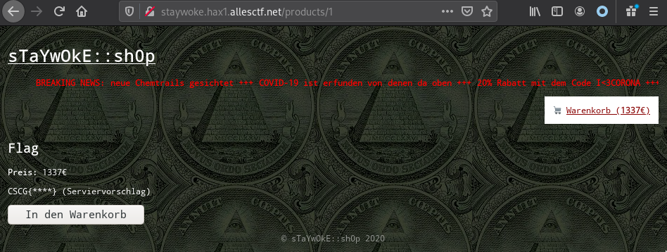
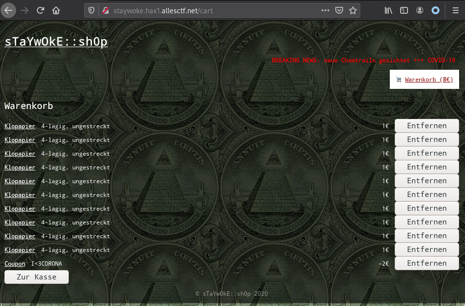

# stayw0ke

## Intro

The challenge presents a web shop application where users can buy certain products.
On checkout, you can choose between the payment methods "w0kecoin" and "Desinfektionsmittel".
Only the first one appears to be implemented, "Desinfektionsmittel" always returns "currently not supported".

For both payment methods, you need to supply a account id.
But we don't any w0kecoins, so how are we going to buy anything?

## First bug: enumerating the accounts

Here's the request that's send on checkout (captured using Burp Proxy):

```
POST /checkout HTTP/1.1
Host: staywoke.hax1.allesctf.net
User-Agent: Mozilla/5.0 (X11; Linux x86_64; rv:76.0) Gecko/20100101 Firefox/76.0
Accept: text/html,application/xhtml+xml,application/xml;q=0.9,image/webp,*/*;q=0.8
Accept-Language: en-US,en;q=0.5
Accept-Encoding: gzip, deflate
Content-Type: application/x-www-form-urlencoded
Content-Length: 79
Origin: http://staywoke.hax1.allesctf.net
Connection: close
Referer: http://staywoke.hax1.allesctf.net/checkout
Cookie: session=s%3AL1BIr8Uh_SQ1gU14r9hq-0rcj9MjIWxz.4tJpt3nfU7q2EVR%2B88lXBChr58EDExOI8YoRHBwCoj8
Upgrade-Insecure-Requests: 1

payment=w0kecoin&account=123123&paymentEndpoint=http%3A%2F%2Fpayment-api%3A9090
```

There's a suspicious parameter called `paymentEndpoint`. If we set it to some random URL (such as `http://example.com`), we get back an error:

> Error while requesting Payment API: Timeout awaiting 'request' for 5000ms 

So this confirms that the backend is making network requests to the payment api supplied by the parameter.
However, it appears that it is not allowed to access the public internet.

Let's see if we can get some more information using error messages. 
When we enter something that causes an invalid URL, such as `http@@@://///`, we get back:

> Error while requesting Payment API: Invalid URL: http@@@://////wallets/123/balance 

Ok, so it tries to request `$paymentApi/wallets/123/balance`. Let's try getting the wallets by using `http://payment-api:9090/wallets?` (the question make ensures the suffix is ignored):

> [{"account":"1337-420-69-93dcbbcd","balance":133500}] 

Nice, we can know buy stuff! But what do we want to buy?

## Second bug: finding the flag
If we look around the shop a little bit, we find that the first product has the URL <http://staywoke.hax1.allesctf.net/products/2>. All the other products use IDs greater than 2.
Wonder what's at <http://staywoke.hax1.allesctf.net/products/1>? 



Ok, so we know what we want to buy. But we don't seem to have enough money? The account only has 1335€, 
but the flag costs 1337€:

## Third bug: buying the flag
If we look at the scrolling banner (this step took me a long time, [banner blindness](https://en.wikipedia.org/wiki/Banner_blindness) is a thing!), it tells us:

> 20% Rabatt mit dem Code I<3CORONA

Trying "I<3CORONA" as coupon for the flag produces an error (visible in the network response):

> coupon not eligible for all items in your cart

Well, then let's try applying this to some other items. We put some products in our cart (10 is the max),
and then apply the code. Here's how the cart looks after applying the code:



But we can see that the coupon has been added as an extra item in our cart! If we now remove all the toilet paper, but keep the coupon and add the flag, we end up with a total of `1337€ - 2€ = 1335€`.
And that's exactly our account balance so we can then buy the flag: `CSCG{c00l_k1ds_st4y_@_/home/}`.

## Mitigation
This challenge presents some classic web application vulnerabilities.
The first is a form of Server-Side Request Forgery. This should be solved using a whitelist of available payment methods, and not letting the user specify arbitrary URLs.
Also, care should be taken in the backend to not expose account numbers in logs or error messages.

The second vulnerability is an insecure direct object reference (IDOR). 
If the flag is meant to be inaccessible, then there should be permission checks in the backend ensuring that.

The third vulnerability is a real logic bug.
If can be compared to a caching issue: the coupon discount is only computed once and then stored.
This creates the possibilites for inconsistencies between the discount and the bought products.
One solution here is to fix the inconsistency, by recalculating the discount when products are removed.
The issue can also be eliminated by design if the coupon discount is simply calculated from the product list each time it is needed.
Then, since the product list + applied coupon code is the source of truth, not inconsistencies can occur.
